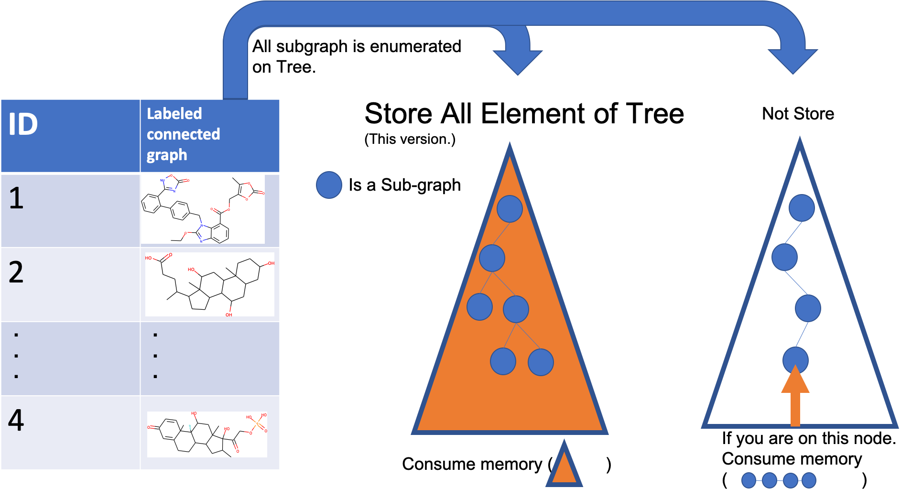

onMemory-gSpan
====

C++ source of Frequent subgraph pattern mining algorithm.
<div align="center">
    
</div>

## Description
- Input : Connected labeled Graph database
- Output : frequent subgraph in database

Implementation of gSpan by non-authors. gSpan is one of the most famous algorithm of frequent subgraph pattern mining. Traverse process store in memory. You can use this module for multiple access to the subgraphs on the traversed tree structure. 


## Requirement
I have checked it under this environment.

Ubunts 7.3.0
- GNU Make 3.81
- gcc 7.3.0

## Install
`$ git clone --recurse-submodules git@github.com:se-z/gSpan.git`

## 3rd party library
- [toml11](https://github.com/ToruNiina/toml11)
- [tree.hh : STL-like C++ tree class](http://tree.phi-sci.com/) 

## Settings
Experimental setting is writtern in toml file in /settings directory.
- data_path : DB's directory path
- struct_file_name : space X
- min_sup : minimum support. minimum value of frequnecy.
- max_depth : max depth of traverse tree. Max size of fragments of graph.

Default setting are follows.
```
data_path = "./demo-data"
struct_file_name = "0.xsdf"
min_sup = 2
max_depth = 3
```

## Demo 

```
$ cd ./src
$ make
$ cd ../
$ ./src/run -a ./settings/test.toml
```

## Others
Output datastructre is DFS Code. It expresses a connected labeled graph.

```
v 0 3
v 1 8
v 2 3
e 0 1 1
e 1 2 1
```

- v arg1 arg2
    - vertex information
        - arg1 : vertex id
        - arg2 : vertex label. 
- e arg1 arg2 arg3
    - edge information
        - arg1 : from vertex id 
        - arg2 : to vertex id 
        - arg3 : edge label

## Citaition
[Original Author page](https://sites.cs.ucsb.edu/~xyan/software/gSpan.htm)

[Xifeng Yan, Jiawei Han (2002). gspan: Graph-based substructure pattern mining. IEEE ICDM 2003, 721-724.](https://sites.cs.ucsb.edu/~xyan/papers/gSpan-short.pdf)

[gSpan : Expanded Version, UIUC Technical Report, UIUCDCS-R-2002-229](https://sites.cs.ucsb.edu/~xyan/papers/gSpan.pdff)

## License
This license is subject to  original authors requirements.

## Author
[hanekichi++](https://github.com/se-z)
